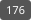
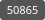

# GitHub User Stat Badges

这个仓库会通过 GitHub Actions 生成 4 个可内嵌在单行文本里的
纯数字 SVG：

- `badges/repos.svg` ：当前 GitHub 用户拥有的 repo 数量，包括 private repo
- `badges/stars.svg` ：当前 GitHub 用户所有 repo 的 star 总数
- `badges/forks.svg` ：当前 GitHub 用户所有 repo 的 fork 总数
- `badges/commits.svg` ：当前 GitHub 用户所有 repo 的 commit 总数

生成逻辑位于 `scripts/generate-badges.js`，工作流位于
`.github/workflows/generate-badges.yml`。

## 工作方式

每次向仓库 push，或者在 GitHub Actions 页面手动运行 workflow 时，
GitHub Actions 会执行脚本：

```sh
node scripts/generate-badges.js
```

脚本会：

1. 使用 GitHub API 读取当前 token 对应的用户信息。
2. 获取该用户拥有的全部仓库，包含 private repo。
3. 汇总仓库数量、star 数、fork 数。
4. 逐个仓库统计该用户在默认分支上的 commit 数。
5. 将结果写入 `badges/*.svg`。
6. 如果 SVG 内容发生变化，workflow 会自动提交更新。

## 配置 GitHub Token

因为默认的 `GITHUB_TOKEN` 不能代表你的个人账号读取所有 private repo，
必须手动配置一个 GitHub Personal Access Token。

推荐使用 classic PAT：

1. 打开 GitHub token 设置页：
   <https://github.com/settings/tokens>
2. 点击 `Generate new token`，选择 classic token。
3. 勾选 `repo` scope。
4. 生成 token 并复制。
5. 打开本仓库的 `Settings` -> `Secrets and variables` -> `Actions`。
6. 新增 repository secret：
   - 名称：`BADGE_GITHUB_TOKEN`
   - 值：刚才生成的 PAT

workflow 也兼容 `GH_STATS_TOKEN`，但优先使用 `BADGE_GITHUB_TOKEN`。

## 手动运行

配置好 secret 后：

1. 打开本仓库的 `Actions` 页面。
2. 选择 `Generate badges` workflow。
3. 点击 `Run workflow`。
4. 等待 workflow 完成。
5. 查看 `badges/` 目录下生成的 SVG。

## 自动运行

每次 push 到任意分支都会触发 workflow。

workflow 中包含防循环逻辑：由 `github-actions[bot]` 自动提交触发的
push 不会再次生成 badge，避免无限提交。

## 在 README 或网页中引用

如果仓库是 public，可以直接通过 raw URL 引用 SVG。
把下面 URL 中的 `<owner>`、`<repo>` 和 `<branch>` 替换成实际值：

```md


```

也可以在 HTML 中使用：

```html


```

## 本地运行

本地运行前，需要先在 shell 中设置 token：

```sh
export BADGE_GITHUB_TOKEN=ghp_xxx
node scripts/generate-badges.js
```

运行完成后会生成或更新：

```text
badges/repos.svg
badges/stars.svg
badges/forks.svg
badges/commits.svg
```

## 统计口径

- repo 数量只统计当前 GitHub 用户拥有的仓库。
- star 和 fork 来自这些仓库的 `stargazers_count` 与 `forks_count`。
- commit 数量按仓库默认分支的 commits API 统计，并传入
  `author=<login>`。
- 空仓库、不可访问仓库、无默认分支仓库会按 0 个 commit 处理。

注意：GitHub API 的 commit author 匹配依赖 GitHub 能否把提交作者关联到
当前用户。未关联邮箱或非默认分支上的提交可能不会被统计进去。

## 输出格式

每个 SVG 都是单行 SVG，内容只显示数字，适合直接嵌入 README、网页、
签名档或其他单行文本环境中。
